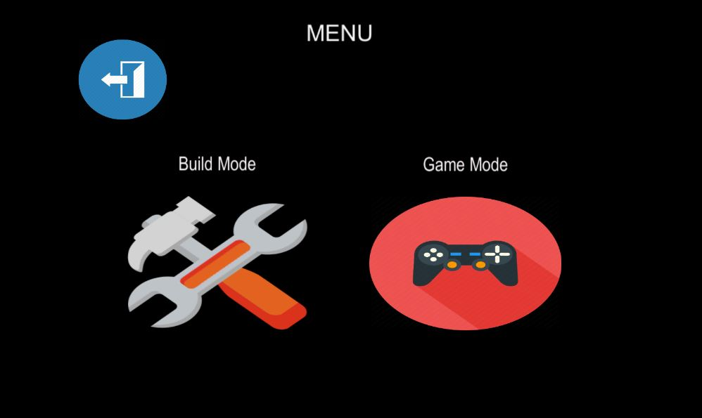

# Interactive Video Game in Augmented Reality using Unity Tool
- Designed an application in which a user can interactively build an augmented 3D scene on a planar surface in the real world.
- My application has two modes: a build mode and a game mode and application starts with a menu of two buttons displaying the two modes. 
Screenshot- 

- ***Build Mode:*** In this mode, the user is able to select and place 3D virtual objects in the real world. Virtual objects like: 
   - Greenhouses: A greenhouse can only be placed on a horizontal planar surface in the real world.
   - Spaceships:  A spaceship should only be placed directly above the selected horizontal surface and should be in constant motion. You may pre-define the motion-path.
   - Planets: A planet can be placed anywhere in the real world except the surface. The planets should be in constant circular motion (to make it simple, you may assume the center of the selected horizontal surface as the center of motion). 

- ***Placement Options***

   - For the greenhouse, a joystick to translate the objects in the x-y direction, on the planar horizontal surface and another joystick to rotate them about the normal direction of the surface. 
  
      Screenshot- 
      
   
   - For the spaceship, a joystick to translate it in the x-y plane perpendicular to the horizontal surface normal and a slider to adjust its height from the plane. 
   
      Screenshot- 
   
   
   - For the planets, a joystick to translate the objects in the x-y direction, a slider to translate the objects in the z direction, and another joystick to rotate them about their own centers. 
      
      Screenshot- 
   

- ***Game Mode:*** In this mode:
● The spaceships should be in the air in constant motion, but occasionally dropping cargo
boxes to the ground, around the greenhouse. The cargo drops must follow the physics
and cast proper shadows.
● The user’s mission is to drag the boxes from the ground into the greenhouse.
● The greenhouses and spaceships should have light sources that will be turned on during
night time and illuminate the surroundings.
● A ‘day’ and ‘night’ mode, is operated by a switch on the screen.
Unlike Assignment 2, you do not need a teleport tube; interaction is limited. However, users should
be able to freely move their mobile devices (e.g., smartphone) around the physical world and the
camera of the virtual world should change accordingly. When the virtual objects are out of the
view of the user’s device camera, then the virtual objects should disappear from the view.
Spaceships
The spaceships’ paths can be either manually set up or dynamically changed within their plane.
Once they complete their paths, they may continue their motion in reverse. They must drop cargo
boxes to the selected horizontal surface at random locations for every specified time (e.g., every
minute).
Greenhouses
The greenhouses will serve as storage rooms for the dropped cargo boxes. The user must drag
the boxes, one by one, by using their finger (or a stylus) to select the box and dragging it across
the mobile device’s screen, to either of the greenhouses to complete the stacking task.
Planets
The planets should be in constant circular motion about the center of the selected horizontal
surface.
Day and Night mode
The lights placed on the spaceships and the greenhouses must turn on when the night mode is
activated; whereas, during the day time, they should be off.

## Tools and Hardware Used:
- Language Used: C# (Microsoft Visual Studio, Unity, Blender)
- Unity Version: 2018.4.16f1 Personal
- Vuforia Version: 8.3.8
- Laptop Configurations: Inspiron 5580, Memory: 8 GB
- Processor: Intel(R) Core(TM) i7-8565U CPU @ 1.80GHz[Cores 4] [Logical/Core 2] Operating System: Microsoft Windows 10 Home Single Language
- Graphic Card Configurations: NVIDIA GeForce MX150, Shared Memory - 3999MB
- Mobile Device Used: Google Pixel XL, Android Version 10, 128 GB ROM.

- ***County Level and State Level:***
I can zoom into a county-level view from a state level view and see how the state as a whole stands. We have supporting visualizations in the form of a pie chart and a bar chart on the right side. 
Screenshot - 

